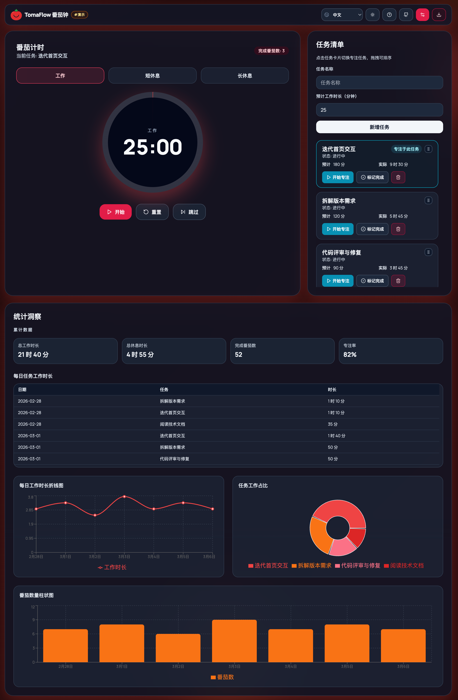

<p>
  
</p>


# TomaFlow Pomodoro (PWA)

**Leer en:** [English](README.md) | [简体中文](README.zh-CN.md) | Español


[](https://github.com/bingoYB/tomaflow/actions/workflows/deploy-pages.yml)
[](https://dash.cloudflare.com/?to=/:account/pages/new)

[](https://vercel.com/new/clone?repository-url=https://github.com/bingoYB/tomaflow&project-name=tomaflow&repository-name=tomaflow)


Aplicación Pomodoro moderna, 100% frontend, construida con React + TypeScript + Tailwind CSS.

## Captura



## Demo en línea

- GitHub Pages: https://bingoyb.github.io/tomaflow/
- Cloudflare Pages: https://tomaflow.pages.dev/
- Vercel: https://tomaflow.vercel.app/
- Modo demo: agrega `#demo` al final de la URL
- Ejemplo: `https://bingoyb.github.io/tomaflow/#demo`

## Despliegue en un clic

- Vercel: haz clic en `Deploy with Vercel`
- Cloudflare Pages: haz clic en `Deploy to Cloudflare Pages` e importa este repositorio de GitHub

## Compatibilidad de despliegue

El proyecto usa `VITE_BASE_PATH` para soportar distintas plataformas:

- GitHub Pages: `VITE_BASE_PATH=/tomaflow/`
- Vercel: valor por defecto `/`
- Cloudflare Pages: valor por defecto `/`

Archivos de configuración:

- `vite.config.ts`: `base` dinámico y PWA (`start_url`, `scope`)
- `.github/workflows/deploy-pages.yml`: define `VITE_BASE_PATH=/tomaflow/`
- `vercel.json`: build/output de Vite + fallback SPA
- `wrangler.toml`: salida de build para Cloudflare Pages
- `public/_redirects`: fallback de rutas SPA para hosting estático

## Inicio rápido

```bash
npm install
npm run dev
```

## Build de producción

```bash
npm run build
npm run preview
```
